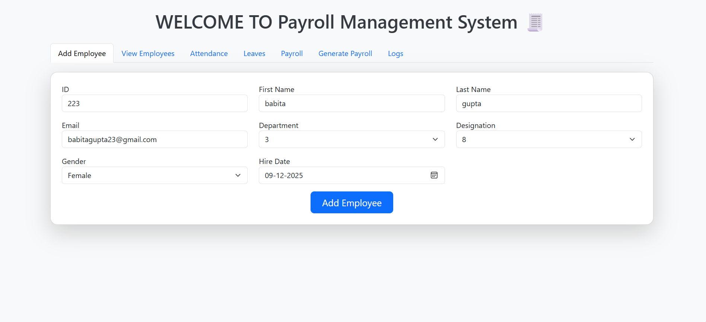
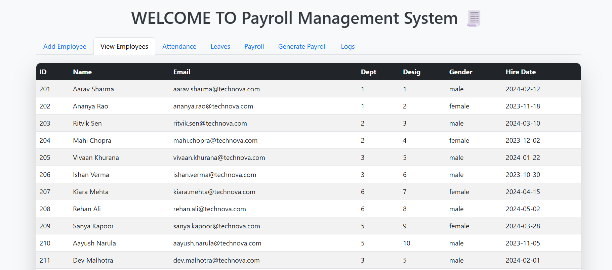
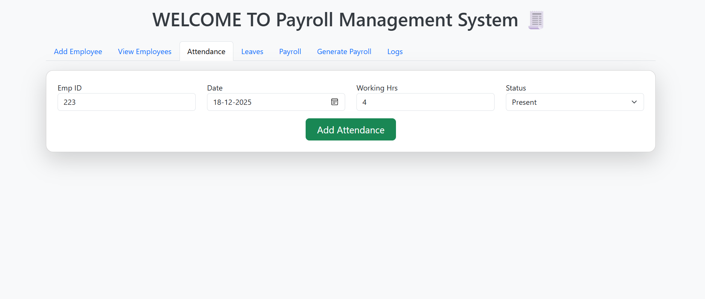
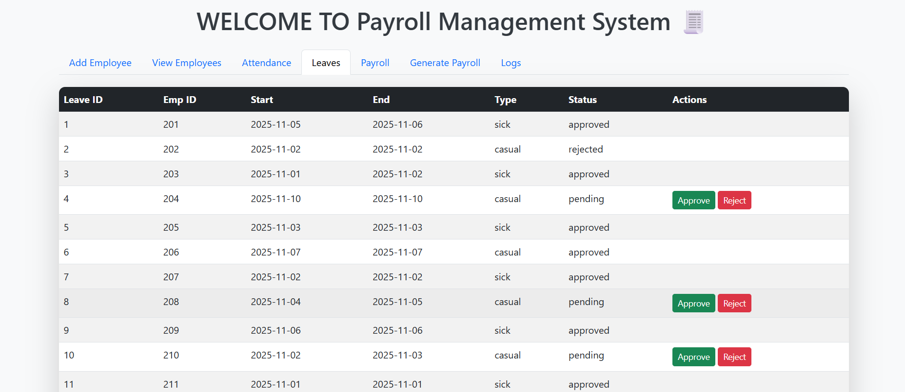
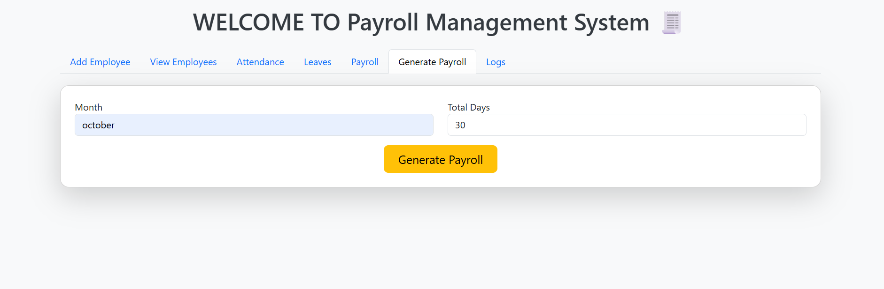
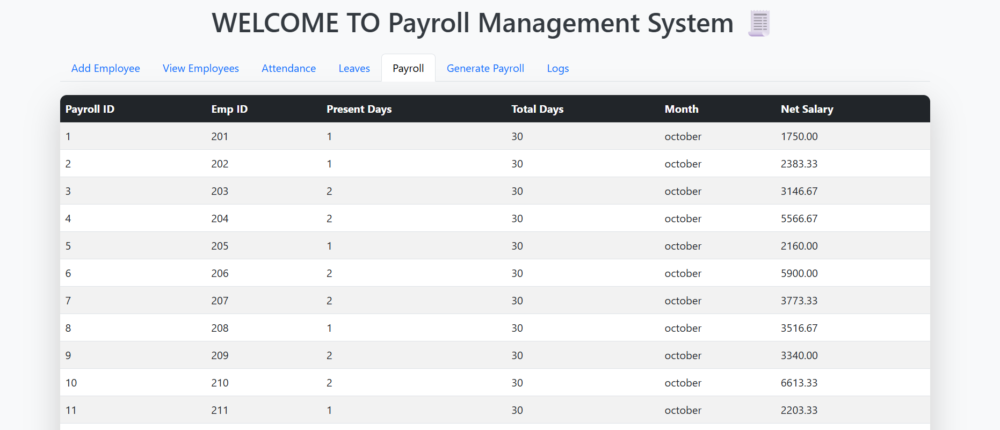
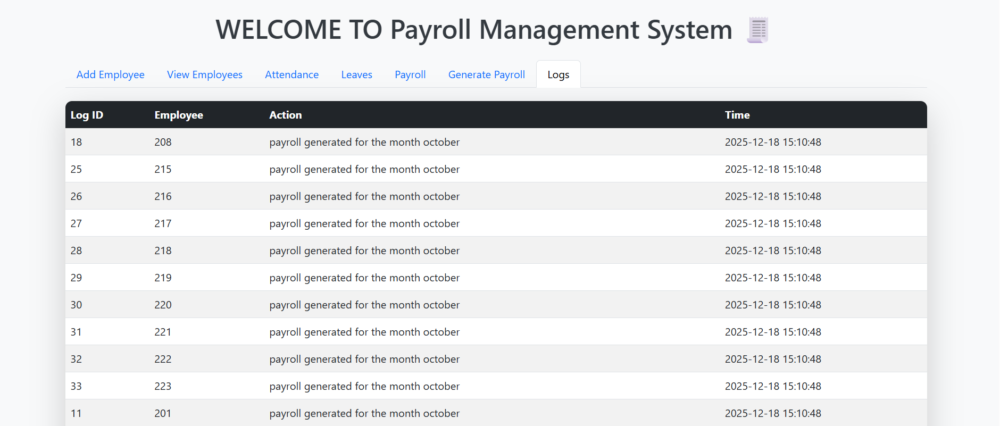

## EmpTrack – Full-Stack Employee Management & Payroll System

EmpTrack is a full-stack web application designed to manage employees, attendance, leaves, and payroll. It demonstrates full-stack integration using Python Flask for the backend, MySQL for database management, and Bootstrap for the frontend interface.

## Features

# Employee Management

Add, view, and update employee details

Track department and designation assignments

Auto-generated default salary structure for new employees
 

# Attendance & Leave Management

Mark daily attendance with status (present, absent, leave)

Approve or reject leave requests

Automatic logging of employee actions for administrative tracking

# Payroll Processing

Generate payroll based on attendance and salary structure

Automatic calculation of net salary considering deductions and taxes

Dynamic generation of payroll reports

# Admin Logs & Tracking

Auto-generated logs for employee actions (addition, deletion, leave approval/rejection, payroll generation)

Helps track all key administrative activities

## Tech Stack

Backend: Python Flask

Frontend: HTML, Bootstrap 5

Database: MySQL (with triggers, stored procedures, and constraints)

Core Concepts: Full-stack integration, CRUD operations, relational database design, automated payroll calculation, state handling

## Database Design

# Tables:

department, designation, employee, employee_contact

attendance, leave_record, salary_structure, payroll

admin_log for action tracking

# Special Features:

Triggers for logging actions automatically

Stored procedures for payroll calculations

Referential integrity with ON DELETE CASCADE or SET NULL

## Setup & Installation

Clone the repo:

git clone <repo-url>
cd EmpTrack

Install dependencies:

pip install flask mysql-connector-python

Create the database:

source payroll.sql;

Run the Flask app:

python app.py

Open in browser:
Visit http://127.0.0.1:5000/

## Usage

Add Employee: Add new employees with department, designation, and contact details.

Attendance: Mark daily attendance for employees.

Leaves: Approve or reject leave requests with automatic logs.

Generate Payroll: Calculate payroll for a selected month based on attendance.

View Logs: Track all administrative actions in real-time.

## Project Highlights

Real-world functionality: Employee management + payroll system integrated in one platform

Full-stack implementation: Frontend + backend + database

Advanced SQL features: Triggers, stored procedures, derived attributes (gross_salary)

Scalable and modular design